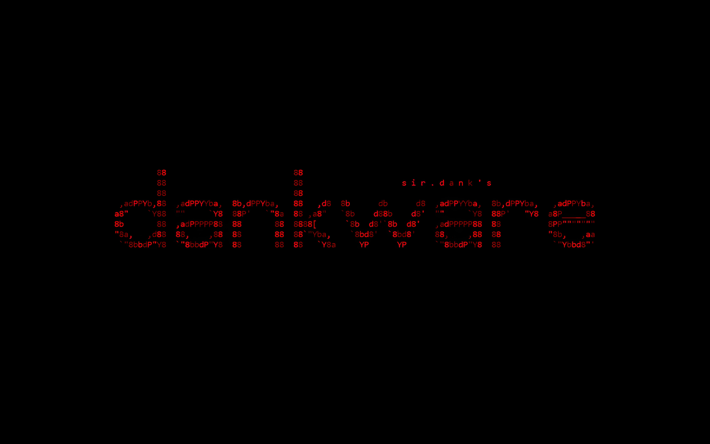

<p align="center">
  <b>~ Visits ~</b><br><br>
  
</p>

<p align="center">
  <b>~ Stats ~</b><br><br>
  
  
  
</p>

# 🚨 dankware 🚨

 Python module with various features! Install with the below command!

```bash
pip install dankware
```

```bash
pip install dankware[extras]
```

Update to the latest version with the below command!

```bash
pip install --upgrade dankware
```

# 🚨 Multithreading 🚨

```py
from dankware import multithread
import time

a = 0
def example():
    global a
    a += 1
    print(a)
    time.sleep(5)
        
multithread(example, 10) # func: example | threads: 10 | single: 50 seconds | multi: 5 seconds
```

<br>

```py
from dankware import multithread
import time

new_list = [1, 2, 3, 4, 5]
sum = 0

def example(num):
    global sum
    sum += num
    time.sleep(5)

multithread(example, 10, new_list) # input_one: list
print(sum)
```

<br>

```py
from dankware import multithread
import time

list1 = [1, 2, 3, 4, 5]
list2 = [5, 4, 3, 2, 1]

def example(num1, num2):
    print(num1 + num2)
    time.sleep(5)

multithread(example, 10, list1, list2) # input_one: list1 | input_two: list2
```

<br>

```py
from dankware import multithread
import time

new_list = [1, 2, 3, 4, 5]

def example(num1, num2):
    print(num1 * num2)
    time.sleep(5)

multithread(example, 10, new_list, 5, progress_bar=False) # input_two: 5 | disabled progress bar
```

<br>

<p>&nbsp;</p>

---  

# 🚨 Export Registry Keys 🚨

```py
import os
from dankware import export_registry_keys

# [NOTE]: this function requires admin privileges!

export_path = "D:\\export.reg"
registry_root = r'HKEY_CURRENT_USER'
registry_path = r'Software\Google\Chrome\PreferenceMACs'
#export_path = os.path.join(os.environ['USERPROFILE'], 'Desktop', 'export.reg')

export_registry_keys(registry_root, registry_path, recursive=True, export_path=export_path)
```


<br>

<p>&nbsp;</p>

---  

# 🚨 Splash Screen 🚨

```py
from dankware.pillow import splash_screen
#from dankware import hide_window, show_window

# Supports: GIFs / PNGs / JPGs / BMPs / ICOs

# hide_window()
splash_screen("D:\\splash.gif", duration=5) # runs on main thread
# show_window()
```

```py
from dankware.pillow import splash_screen
from concurrent.futures import ThreadPoolExecutor
ThreadPoolExecutor(1).submit(splash_screen, "splash.png", 5)
# runs on separate thread
```

<br>

# 🚨 Error Traceback 🚨

```py
import sys
from dankware import err, clr
try: value = 1/0
except Exception as exc:
  print(clr(err((type(exc), exc, exc.__traceback__)),2))
  # OR
  print(clr(err(sys.exc_info()),2))
# OR
try: value = 1/0
except Exception as exc:
  print(clr(err((type(exc), exc, exc.__traceback__),'mini'),2))
  # OR
  print(clr(err(sys.exc_info(),"mini"),2))
```

<br>
<br>

<p>&nbsp;</p>

---  

# 🚨 Scraping 🚨

```py
from dankware import github_downloads
# full url > https://api.github.com/repos/EssentialsX/Essentials/releases/latest
for url in github_downloads("EssentialsX/Essentials"): print(url)
```

<br>

```py
from dankware import github_file_selector
# full url > https://api.github.com/repos/EssentialsX/Essentials/releases/latest
for url in github_file_selector("EssentialsX/Essentials", "remove", ('AntiBuild', 'Discord', 'GeoIP', 'Protect', 'XMPP')): print(url)
```

<br>

<p>&nbsp;</p>

---  

# 🚨 Generate Random IPs 🚨

```py
from dankware import random_ip
print(random_ip())
```

<br>

<p>&nbsp;</p>

---  

# 🚨 GUI File / Path Selector 🚨

```py
from dankware.tkinter import file_selector
path = file_selector() # opens file explorer to select a file
print(path)
```

```py
from dankware.tkinter import folder_selector
path = folder_selector() # opens file explorer to select a folder
print(path)
```

# 🚨 Path Extractor 🚨

```py
import os
from dankware import get_path

if os.name == 'nt': # extracts path from registry
    locations = ("AppData", "Desktop", "Documents", "Favorites", "Local AppData", "Pictures", "Videos", "Music", "Downloads", "Temp")
elif os.name == 'posix':
    locations = ("Desktop", "Documents", "Downloads", "Music", "Pictures", "Videos", "Temp")
for location in locations:
    path = get_path(location)
    print(path)
```

<br>

<p>&nbsp;</p>

---  

# 🚨 Colour Special Characters 🚨

```py
from dankware import clr
# default preset = 1
# default colour_one = white_bright
# default colour_two = red_bright
print(clr("\n  > Hey! Long time no see :)"))
#print(clr("\n  > Hey! Long time no see :)", colour_one = white_bright, colour_two = red_bright))
```

<br>

```py
from dankware import clr, white, magenta
# default preset = 1
# colour_one = magenta
# colour_two = white
print(clr("\n  > Hey! Long time no see :)", colour_one = magenta, colour_two = white))
```

<br>

```py
from dankware import clr
print(clr("\n  This is a string: True | This is an integer: False"))
```

<br>

```py
from dankware import clr, green, magenta, white
# default colour_one = white_bright
# colour_two = green
print(clr(f"\n  > {magenta}Purple{white} thinks he's better than everyone else :(", colour_two=green))
```

<br>

```py
from dankware import clr
# preset = 2
print(clr("\n  > Error in sector [7] redirecting... | INTEGRITY_CHECK: SUCCESS",2))
```

<br>

```py
from dankware import clr
# preset = 3
print(clr("\n  > Is this a randomly coloured string: TRUE | As you can see it does not colour True/False",3))
```

<br>

```py
from dankware import clr, white, white_normal, white_dim, red, red_normal, red_dim
# preset = 3
print(clr("\n  > This is a randomly coloured string based on the input colours!",3,colours=(white_bright, white_normal, white_dim, red_bright, red_normal, red_dim)))
```

<br>

<p>&nbsp;</p>

---  

# 🚨 Banners 🚨

```py
banner = '''

     888                   888                                             
     888                   888           s i r . d a n k ' s               
     888                   888                                             
 .d88888  8888b.  88888b.  888  888 888  888  888  8888b.  888d888 .d88b.  
d88" 888     "88b 888 "88b 888 .88P 888  888  888     "88b 888P"  d8P  Y8b 
888  888 .d888888 888  888 888888K  888  888  888 .d888888 888    88888888 
Y88b 888 888  888 888  888 888 "88b Y88b 888 d88P 888  888 888    Y8b.     
 "Y88888 "Y888888 888  888 888  888  "Y8888888P"  "Y888888 888     "Y8888  

'''
```

## ♦️ Colourize Banner (random) ♦️

```py
from dankware import clr
# preset = 4
print(clr(banner,4))
```

<br>

## ♦️ Align Banner (console center) ♦️

```py
from dankware import align
print(align(banner)) # also works with single text line (even coloured)
```

<br>

## ♦️ Align Coloured Banner ♦️

```py
from dankware import align, clr
print(clr(align(banner),4)) # OR (preferably not) print(align(clr(banner,4)))
```

<br>

<p>&nbsp;</p>

---  

# 🚨 Gradient Reworked [ Originally By @venaxyt ] 🚨

```py
from dankware import fade
banner = '''

                              888 d8b                   888    
       v e n a x y t ' s      888 Y8P                   888    
                              888                       888    
 .d88b.  888d888 8888b.   .d88888 888  .d88b.  88888b.  888888 
d88P"88b 888P"      "88b d88" 888 888 d8P  Y8b 888 "88b 888    
888  888 888    .d888888 888  888 888 88888888 888  888 888    
Y88b 888 888    888  888 Y88b 888 888 Y8b.     888  888 Y88b.  
 "Y88888 888    "Y888888  "Y88888 888  "Y8888  888  888  "Y888 
     888                                                       
Y8b d88P                                                       
 "Y88P"                                                        


'''
```

## ♦️ Black To White ♦️

```py
print(fade(banner, "black2white"))
print(fade(banner, "black2white-v"))
```

<p align="left">
  
  
</p>

## ♦️ Yellow To Red ♦️

```py
print(fade(banner, "yellow2red"))
print(fade(banner, "yellow2red-v"))
```

<p align="left">
  
  
</p>

## ♦️ Green To Yellow ♦️

```py
print(fade(banner, "green2yellow"))
print(fade(banner, "green2yellow-v"))
```

<p align="left">
  
  
</p>

## ♦️ Green To Cyan ♦️

```py
print(fade(banner, "green2cyan"))
print(fade(banner, "green2cyan-v"))
```

<p align="left">
  
  
</p>

## ♦️ Blue To Cyan ♦️

```py
print(fade(banner, "blue2cyan"))
print(fade(banner, "blue2cyan-v"))
```

<p align="left">
  
  
</p>

## ♦️ Blue To Pink ♦️

```py
print(fade(banner, "blue2pink"))
print(fade(banner, "blue2pink-v"))
```

<p align="left">
  
  
</p>

## ♦️ Pink To Red ♦️

```py
print(fade(banner, "pink2red"))
print(fade(banner, "pink2red-v"))
```

<p align="left">
  
  
</p>

## ♦️ Random ♦️

```py
print(fade(banner, "random"))
```

<p align="left">
  
</p>

<p>&nbsp;</p>

---  

# 🚨 Also check out 🚨

<p align="center">
  <a href="https://github.com/SirDank/dank.tool">
  
  </a>
</p>

<p>&nbsp;</p>

---  

# 🚨 Wallpapers 🚨

## ♦️ Style 1 ♦️

<br><p align="center"></p><br>

## ♦️ Style 2 ♦️

<br><p align="center"></p><br>

## ♦️ Style 3 ♦️

<br><p align="center"></p><br>

## ♦️ Style 4 ♦️

<br><p align="center"></p><br>

<p>&nbsp;</p>

---  

# 🚨 Stats 🚨

<br><p align="center"></p><br>

# 🚨 Star History 🚨

<p align="center">
<a href="https://star-history.com/#SirDank/dankware&Date">
  <picture>
    <source media="(prefers-color-scheme: dark)" srcset="https://api.star-history.com/svg?repos=SirDank/dankware&type=Date&theme=dark" />
    <source media="(prefers-color-scheme: light)" srcset="https://api.star-history.com/svg?repos=SirDank/dankware&type=Date" />
    
  </picture>
</a>
</p>
